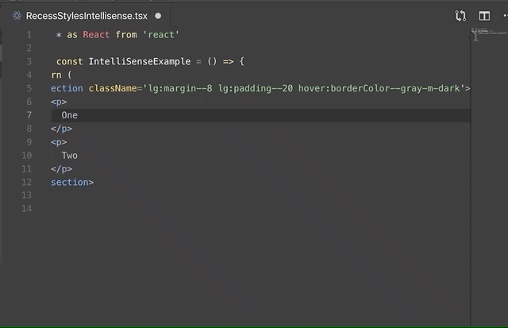

# Recess Styles CSS IntelliSense

Classname autocomplete for [recess](https://recess.guildeducation.com/#/CSS) css utilities

## Features
---

### Autocomplete

Recess Styles CSS IntelliSense provides suggestions of recess-style classes as you type. It auto-generates suggestions based on the current recess version you have installed in `node_modules`. 

#### React
- Classname suggestions as you type
- css preview when hovering over classnames

## Examples
---

__Classname suggestion__

__CSS Preview__

